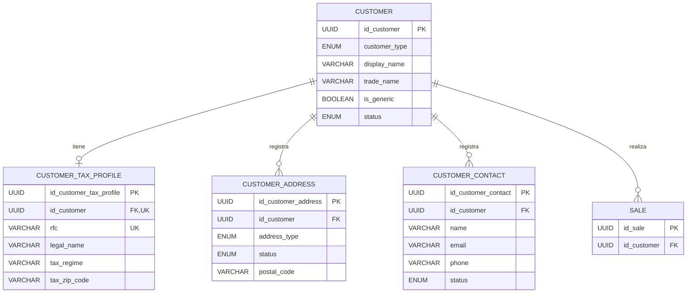

# ADR03: Dominio de Clientes (`customer`)

## Estado

Implementado el alcance inicial. Ver [decisiones de implementación, API y migración](./customer_implementation.md).

## Contexto

El modulo de clientes tiene como objetivo administrar la informacion de las personas o entidades que adquieren bienes o servicios de la institucion

El cliente como una entidad central que psoteriormente se relacionara con otros modulos del ERP, principalmente

- Ventas
- Facturas
- Cuentas por cobrar
- Pagos
- Contabilidad

---

## Definicion de Cliente

Un cliente es una persona o entidad que adquiere bienes o servicios de la institucion

Un cliente puede ser:

- Persona fisica
- Persona moral / empresa

Un cliente puede realizar multiples operaciones comerciales a lo largo del tiempo

**Relacion principal**

```text
CUSTOMER 1 ───────── N SALE
```

Un cliente puede tener muchas ventas, pero cada venta pertenece a un cliente

---

## Entidades del modulo

El modulo esta compuesto inicialmente por las sigueintes entidades

```text
Customer
├── CustomerTaxProfile
├── CustomerAddress
└── CustomerContact
```

Estas entidades representan diferentes aspectos de la informacion del cliente

---

### Entidad Cliente (`customer`)

Representa al cliente dentro del sistema

| Campo | Tipo | Restriccion | Descripcion |
| :--- | :--- | :--- | :--- |
| `id_customer` | UUID | PK | Identificador unico del cliente |
| `customer_type` | ENUM | NOT NULL | Tipo de cliente |
| `display_name` | VARCHAR | NOT NULL | Nombre con el que se identifica al cliente en la relacion comercial |
| `trade_name` | VARCHAR | NULL | Nombre comercial |
| `is_generic` | BOOLEAN | NOT NULL, DEFAULT false | Identifica el registro protegido PUBLICO GENERAL |
| `status` | ENUM | NOT NULL | Estado del cliente |
| `created_at` | TIMESTAMP | NOT NULL | Fecha de creacion |
| `updated_at` | TIMESTAMP | NOT NULL | Ultima modificacion |

`display_name` permite identificar al cliente aunque todavia no tenga datos fiscales. Para una persona fisica puede ser su nombre; para una empresa, el nombre con el que se le conoce comercialmente. `trade_name` es opcional y permite registrar expresamente el nombre comercial de una empresa.

La razon social o nombre fiscal se almacena exclusivamente en `customer_tax_profile.legal_name`.

#### `customer_type`

Valores propuestos:

- PERSON
- COMPANY

#### `status`

- ACTIVE
- INACTIVE

La desactivacion de un cliente no debe eliminar su informacion historica, especialmente si ya tiene ventas asociadas

---

### Entidad Perfil Fiscal del Cliente (`customer_tax_profile`)

Representa la informacion fiscal asociada al cliente

Un cliente puede existir sin perfil fiscal. Cada cliente puede tener cero o un perfil fiscal, y cada perfil pertenece a un solo cliente.

```text
CUSTOMER 1 ───────── 0..1 CUSTOMER_TAX_PROFILE
```

El perfil se crea cuando se dispone de todos sus datos obligatorios. La ausencia de datos fiscales se representa con la ausencia del perfil; sus campos obligatorios no se guardan vacios ni como `NULL`. Para facturar se requiere un perfil fiscal completo y validado.

| Campo | Tipo | Restriccion | Descripcion |
| :--- | :--- | :--- | :--- |
| `id_customer_tax_profile` | UUID | PK | Identificador del perfil fiscal |
| `id_customer` | UUID | FK, UNIQUE, NOT NULL | Cliente asociado; solo un perfil por cliente |
| `rfc` | VARCHAR | NOT NULL, UNIQUE | RFC del cliente; no se comparte entre clientes |
| `legal_name` | VARCHAR | NOT NULL | Nombre o razon social fiscal |
| `tax_regime` | VARCHAR | NOT NULL | Regimen fiscal |
| `tax_zip_code` | VARCHAR | NOT NULL | Codigo postal fiscal |
| `created_at` | TIMESTAMP | NOT NULL | Fecha de creacion |
| `updated_at` | TIMESTAMP | NOT NULL | Ultima modificacion |

#### Captura y modificacion del RFC

- **Captura inicial:** se permite registrar el RFC por primera vez al crear el perfil fiscal, incluso si el cliente ya tiene transacciones. Esto permite completar los datos fiscales de un cliente que anteriormente compro sin ellos.
- **Modificacion de un RFC existente:** solo se permite si el cliente no tiene transacciones. La correccion debe quedar auditada con el valor anterior, el nuevo valor, el motivo, la fecha y el responsable del cambio.
- **Cliente con transacciones y RFC registrado:** no se permite modificar ese RFC ni eludir la regla eliminando y recreando el perfil fiscal.
- La captura inicial y las correcciones deben respetar la unicidad del RFC entre clientes.

> **NOTA:** Los datos fiscales deberan validarse conforme a los requerimientos de facturacion de la institucion

---

### Entidad Direccion de Cliente (`customer_address`)

Representa las diferentes direcciones asociadas a un cliente

Un clietne puede tener multiples direcciones

```text
CUSTOMER 1 ───────── N CUSTOMER_ADDRESS
```

| Campo | Tipo | Restriccion | Descripcion |
| :--- | :--- | :--- | :--- |
| `id_customer_address` | UUID | PK | Identificador de la direccion |
| `id_customer` | UUID | FK | Cliente propietario |
| `address_type` | ENUM | NOT NULL | Tipo de direccion |
| `street` | VARCHAR | NOT NULL | Calle |
| `external_number` | VARCHAR | NULL | Numero exterior |
| `internal_number` | VARCHAR | NULL | Numero interno |
| `neighborhood` | VARCHAR | NULL | Colonia |
| `city` | VARCHAR | NOT NULL | Ciudad |
| `municipality` | VARCHAR | NULL | Municipio |
| `state` | VARCHAR | NOT NULL | Estado |
| `country` | VARCHAR | NOT NULL | Pais |
| `postal_code` | VARCHAR | NOT NULL | Codigo postal |
| `status` | ENUM | NOT NULL, DEFAULT ACTIVE | Vigencia de la direccion: ACTIVE o INACTIVE |
| `created_at` | TIMESTAMP | NOT NULL | Fecha de creacion |
| `updated_at` | TIMESTAMP | NOT NULL | Ultima modificacion |

#### `address_type`

Valores propuestos:

- FISCAL
- BILLING
- SHIPPING
- OTHER

#### Vigencia e historial de direcciones

- Cada cliente puede tener como maximo una direccion `FISCAL` con estado `ACTIVE`.
- La base de datos debe garantizar la unicidad de `id_customer` para las direcciones que cumplan `address_type = FISCAL` y `status = ACTIVE`. Esta restriccion no aplica a las direcciones fiscales inactivas ni a los otros tipos de direccion.
- Al sustituir la direccion fiscal vigente, se conserva la anterior con estado `INACTIVE` y se registra la nueva con estado `ACTIVE`. Ambos cambios deben realizarse en una misma transaccion para conservar el historial y respetar la unicidad.
- Un cliente puede tener multiples direcciones `SHIPPING` activas.

**Ejemplo:**

```text
Cliente: Metalúrgica del Bajío

Direcciones:
├── Fiscal
├── Facturación
├── Entrega - Planta León
└── Entrega - Planta Silao
```

---

### Entidad Contacto del Cliente (`customer_contact`)

Representa a las personas de contacto relacionadas con un cliente

Un cliente puede tener cero o multiples contactos. Para una persona fisica no es obligatorio crear un contacto separado; cuando sea necesario registrar sus medios de contacto, el propio cliente puede figurar como contacto.

```text
CUSTOMER 1 ───────── 0..N CUSTOMER_CONTACT
```

| Campo | Tipo | Restriccion | Descripcion |
| :--- | :--- | :--- | :--- |
| `id_customer_contact` | UUID | PK | Identificador del contacto |
| `id_customer` | UUID | FK | Cliente asociado |
| `name` | VARCHAR | NOT NULL | Nombre |
| `last_name` | VARCHAR | NULL | Apellidos |
| `email` | VARCHAR | NULL | Correo electronico |
| `phone` | VARCHAR | NULL | Telefono |
| `position` | VARCHAR | NULL | Puesto o funcion |
| `status` | ENUM | NOT NULL | Estado del contacto |
| `created_at` | TIMESTAMP | NOT NULL | Fecha de creacion |
| `updated_at` | TIMESTAMP | NOT NULL | Ultima modificacion |

**Ejemplo:**

```text
Contactos:
├── Juan Pérez
│   └── Compras
│
├── María López
│   └── Contabilidad
│
└── Pedro García
    └── Almacén
```

---

## Relaciones con otros modulos

El modulo de clientes no debe contener directamente toda la logica de modulos como lo puede ser ventas, facturacion o cotnabilidad.

Su responsabilidad principal es proporcionar la identidad e informacion necesaria del cliente

### Cliente -> Venta

```text
CUSTOMER 1 ───────── N SALE
```

Un cliente puede tener multiples ventas

La entidad `sale` debera contener la referencia:

> `id_customer` FK

Toda venta debe referenciar un cliente. Para ventas de mostrador o contado sin facturacion puede utilizarse el cliente generico `PUBLICO GENERAL`; las ventas a credito requieren un cliente identificado.

---

### Cliente -> Cuenta por cobrar

Conceptualmente

```text
CUSTOMER
    │
    ▼
SALE
    │
    ▼
ACCOUNT_RECEIVABLE
    │
    ▼
PAYMENT
```

Una cuenta por cobrar representa una cantidad pendeinte de recibir del cliente

La implementacion exacta debera definirse al diseñar el modulo de cuentas por cobrar

---

## Ventas y cobros

Una venta no implica necesariamente que el cleinte haya realizado un pago

**Ejemplo:**

```text
Cliente
   │
   ▼
Venta $11,600
   │
   ├── Contado
   │      └── Pago inmediato
   │
   └── Crédito
          └── Cuenta por cobrar
                    │
                    └── Pago posterior
```

Por lo tanto, venta y pago deben tratarse como conceptos diferentes

---

## Cancelacion de una venta

La cancelacion de una venta debe analizarse de acuerdo con el estado de la operacion

Una venta puede encontrarse por ejemplo en:
- CREATED
- CONFIRMED
- PAID
- CANCELLED

La cancelacion debe considerar si la operacion produjo efectos en otros modulos

**Venta sin pago**

```text
Venta
  ↓
Cancelación
  ↓
No existe devolución de dinero
```

**Venta ya pagada**

```text
Venta
  ↓
Pago
  ↓
Cancelación
  ↓
Devolución / reversión correspondiente
```

**Venta con cuenta por cobrar**

```text
Venta
  ↓
Cuenta por cobrar
  ↓
Cancelación
  ↓
Cancelación o reversión de la cuenta por cobrar
```

> La forma exacta de realizar las reversiones contables, fiscales  y
> financieras debera definirse junto con las reglas del modulo de ventas y contabilidad

---

## Impacto contable

El modulo de clientes no debe ser responsable de generar directamente los movimientos contables

El cliente proporciona informacion que puede ser utilizada por otros dominios

**Por ejemplo:**

```text
Cliente
   ↓
Venta
   ↓
Evento de negocio
   ↓
Contabilidad
```

Una venta a credito podria producir conceptualmente:

```text
Debe:
    Cuentas por cobrar

Haber:
    Ventas
    IVA trasladado
```

Posteriormente, cuando se recibe el pago:

```text
Debe:
    Bancos / Caja

Haber:
    Cuentas por cobrar
```

Los detalles de estas operaciones pertenecen al dominio contable

---

## Modelo conceptual



Cuentas por cobrar y pagos de clientes quedan fuera de la implementacion inicial.

---

## Decisiones de negocio

Las siguientes respuestas establecen las reglas del modelo. Los detalles de facturacion, ventas, pagos y contabilidad se definiran en sus respectivos modulos.

- [X] ¿Puede existir un cliente sin RFC?

  Si. El cliente puede existir sin perfil fiscal. Cuando se crea el perfil, son obligatorios el RFC, el nombre o razon social fiscal, el regimen fiscal y el codigo postal fiscal. Para facturar se requiere el perfil completo y validado.

- [X] ¿El RFC debe ser unico?

  Si. No debe haber dos clientes con el mismo RFC; `customer_tax_profile.rfc` tiene una restriccion `UNIQUE`.

- [X] ¿Puede cambiar el RFC de un cliente?

  La captura inicial del RFC se permite aunque el cliente ya tenga transacciones. Modificar un RFC existente solo se permite si el cliente no tiene transacciones, y la correccion debe quedar auditada conforme a las reglas del perfil fiscal. Si ya tiene transacciones y un RFC registrado, no se permite modificarlo ni eliminar y recrear el perfil para sustituirlo.

- [X] ¿La razon social pertenece a `customer` o exclusivamente a los datos fiscales?

  Pertenece exclusivamente a `customer_tax_profile.legal_name`, porque forma parte de la identidad fiscal. `customer` representa la relacion comercial y utiliza `display_name` para identificar al cliente, incluso si no tiene perfil fiscal.

- [X] ¿Se requiere diferenciar nombre legal y nombre comercial?

  Si. La razon social se almacena en `customer_tax_profile.legal_name` y el nombre comercial opcional en `customer.trade_name`. Ejemplo: razon social `Comercializadora X S.A de C.V` y nombre comercial `Comercializadora X`.

- [X] ¿Qué datos fiscales son obligatorios?

  Al crear el perfil fiscal, como minimo: RFC, nombre o razon social fiscal, regimen fiscal y codigo postal fiscal. Los demas deben definirse segun el proceso de facturacion de la institucion.

- [X] ¿Qué tipos de direcciones necesita la institución?

  Como minimo fiscal (`FISCAL`) y entrega (`SHIPPING`). El modelo tambien contempla facturacion (`BILLING`) y otras (`OTHER`), que pueden utilizarse si el negocio las necesita.

- [X] ¿Puede existir más de una dirección fiscal?

  Puede haber varias registradas como historial, pero como maximo una con estado `ACTIVE` por cliente. Al sustituirla se conserva la anterior con estado `INACTIVE`.

- [X] ¿Puede existir más de una dirección de entrega?

  Si. Se permiten multiples direcciones `SHIPPING` activas, especialmente para empresas con sucursales y multiples ubicaciones.

- [X] ¿Se requieren contactos para personas físicas?

  No necesariamente. Para una persona fisica el propio cliente puede ser el contacto. Para empresas si seria util tener multiples contactos.

- [X] ¿Puede un cliente estar inactivo teniendo ventas históricas?

  Si. Inactivar un cliente no debe eliminar ni afectar sus ventas historicas.

- [X] ¿Puede una venta existir sin cliente?

  Toda venta debe referenciar un cliente. Para ventas de mostrador o contado sin facturacion se permite el cliente generico `PUBLICO GENERAL`. Para ventas a credito se requiere un cliente identificado.

- [X] ¿Cómo se maneja una venta de contado?

  La venta genera el ingreso y el pago se registra inmediatamente. No deberia quedar una cuenta por cobrar pendiente.

- [X] ¿Cómo se maneja una venta a crédito?

  La venta genera una cuenta por cobrar asociada al cliente. El pago posterior reduce esa cuenta por cobrar.

- [X] ¿Qué ocurre con una cuenta por cobrar cuando se cancela una venta?

  La cuenta por cobrar debe cancelarse o revertirse, siempre que la venta aun no haya sido liquidada.

- [X] ¿Qué ocurre si la venta ya fue pagada?

  La cancelacion debe generar la reversion correspondiente del pago o dejar un saldo a favor, dependiendo de las politicas establecidas en el modulo de ventas. No se debe simplemente borrar el pago.

- [X] ¿Qué ocurre si la venta ya fue facturada?

  La cancelacion de la venta debe considerar tambien la cancelacion de la factura fiscal. Esto depende del proceso de CFDI.

- [X] ¿Qué eventos de venta generan movimientos contables?

  Como minimo: venta, pago o cobro, cancelacion o devolucion y ajustes. Exactamente que cuentas se afectan debe definirse con quien maneje la contabilidad.

---

## Alcance inicial

Para la primera versión del módulo se propone implementar únicamente:

- `Customer`
- `CustomerTaxProfile`
- `CustomerAddress`
- `CustomerContact`

Las entidades:

- `Sale`
- `Invoice`
- `AccountReceivable`
- `Payment`
- `AccountingEntry`

se desarrollarán en sus respectivos módulos y se relacionarán posteriormente con Customer.
